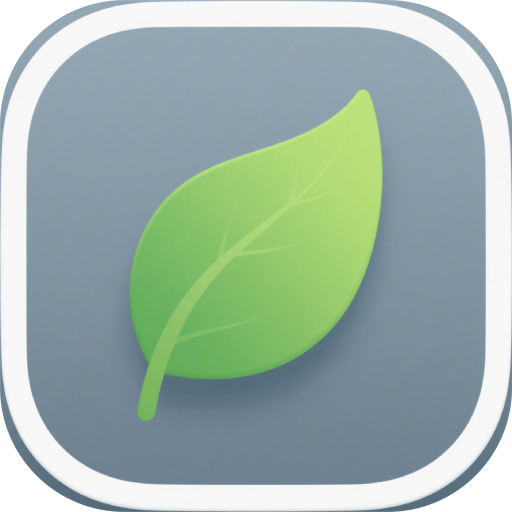

<h1 align="center">🍃 Folium</h1>

<p align="center">
  <strong>A powerful, open-source PDF reader built for academic research and deep reading</strong>
</p>

<p align="center">
  
  
  
  <!--  -->
</p>

<p align="center">
  
</p>

---

🎉 **Say hello to Folium** — the PDF reader _designed by researchers, for researchers_! Whether you're diving into dense scientific papers or preparing to present a journal club, **Folium makes literature reading smarter, faster, and more enjoyable**. 💡📚

✨ Open-source, free forever, and built with ❤️ using **Electron-Vite**, **Vue 3**, and **TypeScript**.

🎯 **Perfect for**:

- 🔍 **In-Depth Reading of Research Papers** — Focus deeply with distraction-free reading and rich annotations.
- 🎤 **Presenting & Explaining Literature** — Annotate, summarize, and prepare your talk with AI-powered insights.

---

## 🌟 Features

- 🖋️ **Multi-Layer Annotation** — Draw, highlight, and add sticky notes on separate layers. Organize your thoughts like a pro! ✍️🎨
- 🔎 **One-Click Word Translation** — Highlight any term and get instant translations — perfect for non-native English readers! 🌐🔄
- 🤖 **AI-Powered Full-Text Understanding** — Let AI summarize, explain key findings, or answer your questions about the paper! 🧠💬
- 💻 **Cross-Platform Support** — Seamlessly run on **Windows & macOS** with native performance.
- 🔒 **Open Source & Free Forever** — No ads, no paywalls, no tracking. Just pure academic freedom. 🙌
- 🚀 **Blazing Fast** — Powered by **Electron-Vite**, enjoy near-instant startup and smooth rendering.

---

## 📦 Tech Stack

Built with modern tools for performance and maintainability:

| Tool              | Purpose                          |
| ----------------- | -------------------------------- |
| **Electron-Vite** | Ultra-fast dev server & HMR      |
| **Vue 3**         | Reactive UI with Composition API |
| **TypeScript**    | Type-safe codebase               |
| **Vite**          | Lightning-fast frontend build    |
| **Electron**      | Cross-platform desktop app       |

🔧 Dev Dependencies: `electron`, `electron-vite`, `vite`, `vue`, `typescript`, `electron-builder`

---

## 🛠️ Project Setup

### Install Dependencies

```bash
npm install
```

### Development (Hot Reload)

```bash
npm run dev
```

👉 Opens the app in development mode with instant HMR for renderer and hot restart for main process!

### Build for Production

```bash
# Build for Windows
npm run build:win

# Build for macOS
npm run build:mac

# Build for Linux
npm run build:linux
```

📦 Outputs a ready-to-distribute installer or app bundle using **`electron-builder`**

## 🙏 Acknowledgements

Huge thanks to these amazing projects that made Folium possible:

- [Electron-Vite](https://github.com/alex8088/electron-vite?spm=a2ty_o01.29997173.0.0.2aa25171e9brO9) — For enabling blazing-fast Electron development 🚀
- [Electron](https://www.electronjs.org/?spm=a2ty_o01.29997173.0.0.2aa25171e9brO9) — Powering cross-platform desktop apps 💻
- [Vite](https://vitejs.dev/?spm=a2ty_o01.29997173.0.0.2aa25171e9brO9) — Next-gen frontend tooling ⚡
- [Vue 3](https://vuejs.org/?spm=a2ty_o01.29997173.0.0.2aa25171e9brO9) — Elegant, reactive UI framework 🎨

Also inspired by open-source communities pushing the future of academic tools! 🌍

## 🌱 Join the Movement!

We believe knowledge should be open, and tools for learning should be too.

⭐ Star this repo to support open science
🐞 Report issues or suggest features — we read every one!
🤝 Contribute code, translations, or docs — all hands welcome!

📬 Have questions? Want to collaborate?
Reach out on GitHub or open a discussion!

❤️ Made with passion for research, reading, and lifelong learning.
— The Folium Team 🍃
